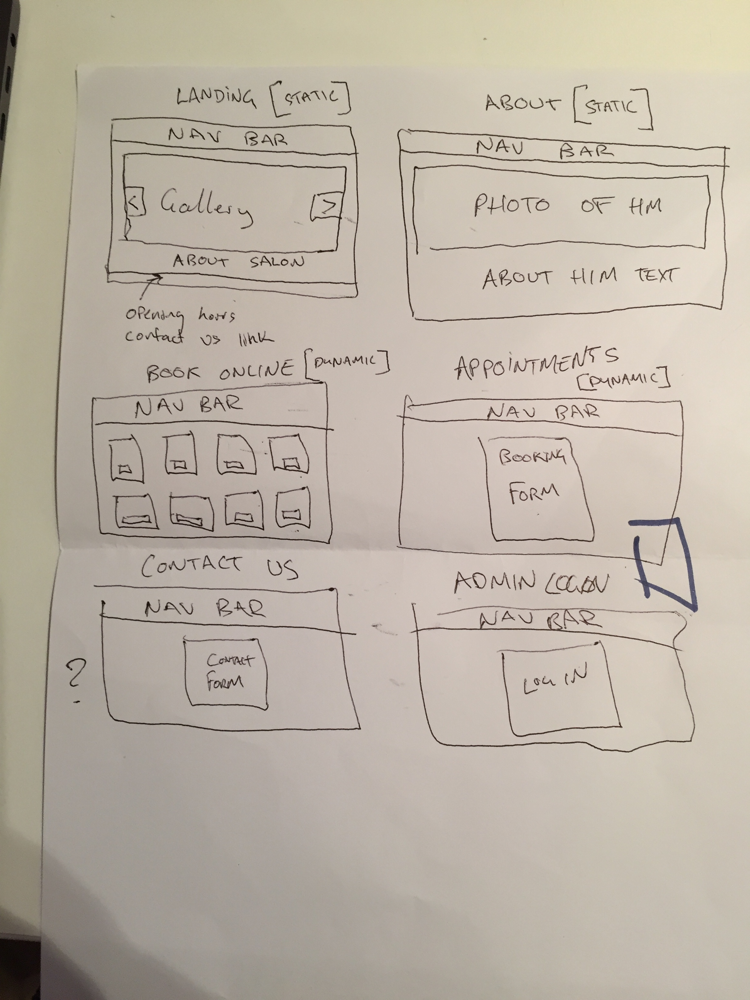

# MERN Project: Eric Rebeiro
## Team: hackScript(boys)
Completed as a major assessment in Term 3 Coder Academy’s Fast Track Bootcamp using MERN Stack By Hackscript Boys(Punya, Rafael, Sam Li, Rhys and Sam Foong).

View Live (Heroku): https://hairbyerric.herokuapp.com

View Github : https://github.com/Thebeleiver1/eric-ribeiro

---

## Table of Contents
- [Project-Brief](#Project-Brief)
- [Problem Definition and Solution](#Problem-Definition-and-Solution)
	- [Problem](#Problem)
	- [Solution](#Solution)
- [User Stories](#User-Stories)
- [WorkFlow Diagram](#WorkFlow-Diagram)

- [Wireframes](#Wireframes)

- [Entity Relationship Diagram (ERD)](#Entity-Relationship-Diagram)

- [Tools & Methodologies](#Tools-&-Methodologies)

- [Technologies Used](#Technologies-Used)

- [Installation/Setup/Deployment](#Installation/Setup/Deployment)

- [Future Development Improvement](#Future-Development-Improvement)

---

## Project Brief
- Design, build, deploy and present an application built for a real world customers
- Meet with the business owner or organisation manager to find out what challenges they face
- Find a problem that can be solved with an application


---

## Problem Definition and Solution

Our Client Mr Eric Rebeiro who is an experienced hairdresser seeks to create a website with more functionality for it to market his hairstyling business. He currently has a simple app created using wix however he finds that the website is very rigid and not as customisable. 

Problems

The client would want functionalities which are:
- more robust booking system with appointment reminders and a contact us messaging system. 
- he wants to be able to make bookings with limited information(name and phone number)
- client does not have any marketing component on his website or analytics features.

Solutions

We will create a website that focuses on the ease of making appointments based on the service which they have chosen. Logging in as an admin, the client is able to make bookings for client with just minimal information(name and phone number). 

---

## User Stories
### Business Owner

* As a business owner, my clients should be able to make online bookings  so that they don’t have to call the salon to make appointments.
* As the business owner, I should be able to put phone bookings into my online booking system, so that all my bookings are in one place.
* As a business owner I only want to require a name and phone number from my clients, so that my clients feel safer.
* As a business owner i would like the flexibility to be able to make bookings out of business hour, to cater to clients who are unable to attend during business hours. 
* As a business owner I should be able to see all the bookings in a calender of the booking system as a one stop view.
* As a business owner, I should be able to see my clients reviews on my website, so that potential clients can read what others have said about me.
* As a business owner I want to be able to write blog posts about new products and specials, so that my clients are up to date with what is happening.
* As a business owner I want a seperate admin page, so that I can manage things like blog posts and bookings.
* As a business owner I would like to incorporate my instagram page to my website so that clients can check out my work straight on my instagram.
* As a business owner, I want my clients to receive SMS/email reminders for their appointments 24 hours before the allocated time, so that my clients remember their appointments.
* As a business owner, I want to know business analytics on how a promotion I post online will affect the page views on my website,
* As a business owner, I would like to have a page on my website about me so that the client can know more about me as their hairstylist and future team members which I might employ.
* As a business owner I want my website to emphasise that I use environmentally friendly and sustainable products, so that my clients know about the products I use.
* As a business owner, I want to be able to acquire a new domain name and redirect from the old one to the new one, so that my brand is more consistent.
* As a business owner, I want my site to feel very natural and ‘Brazilian’ so that it consistent with my personal brand.
* As a business owner I want to display my business hours so that my clients know what time my salon is open.
* As a business owner, I want to have my address and phone number on my site, so that clients who don’t wish to book online can contact me in other ways.

### Clients

* As a client I would like to have the option to edit my appointments if my plans changed.
* As a client, I would like to make my bookings online, so that I don't have to call the salon and I can see all the available times whenever I wish to make a booking.
* As a potential client, I want to be able to browse the services on offer before I make a booking, so that I know what is on offer and how long each service takes.
* As a potential client, I would like to be able to read about the salon and the stylist working there, so that I know if the salon fits well with my style.
* As a client, I would like to be informed of new products and specials that are on offer at the salon, so that I can make bookings and visits to the salon at the right times to take advantage of special offers.
* As a potential client, I want to be able to easily navigate the site and find relevant information easily, so that I am able to have an enjoyable and hassle free experience.
---

## Workflow Diagram of User Journey


---

## Concept, Design and Build

### Style Guide

We have design the website on a minimalistic approach. Below are the colour and font type which we have apply to our website.

Colour


Font Type


## Wireframes of App

## Lo-fi wireframes for desktop


## Hi-Fi wireframes for desktop


## Hi-fi wireframes for mobile


---

## Entity Relationship Diagram

The initial MVP schema design for our app.


Updated design for our database.


---

### Tools & Methodologies

**Trello Board**


**Trello Gantt**


**Slack**


**Github**

[Link to team's github page](https://github.com/Thebeleiver1/eric-ribeiro)

**Agile**

**Code Review**
Code Review are done on a regular basis with the rest of the team mates. This is to ensure that they are not stuck on a problem for too long and that everyone understand the code. Besides that this also help with refactoring the code to make sure that it's understandable and cleaner.


**Client Communication**


 

 

 


---

## Technologies Stack Used (Marked in bold)
This project was built with : **node.js** and **Mongodb** with **mongoose** for the server and **create-react-app** for the frontend.

Some other dependencies we used include **Reactstrap** for our frontend design elements and **React-router-dom** for all our routing, which allows for a seamless flow between pages. 

Authentication
**Passport** combined with **JWT tokens** were used for authenticating the user on the frontend.

Notable Packages, Services & Tools Used
**Sendgrid**
We have used sendgrid so that people who sign up will receive an email regarding confirmation of them signing up.

**Twillio**
We have used Twilio so that client is being sent a sms reminder prior to them coming in for their appointment. 

---

## Installation/Setup/Deployment

1. ```git clone https://github.com/Thebeleiver1/eric-ribeiro.git``` to your desired directory.
<br><br>`eric-frontend` serves as the front end, and `booking-api` as the back end.

2. `cd` into `eric-frontend` and do `npm install`
3. `cd` into `booking-api` and do `npm install`
4. launch the server from `eric-frontend` with `npm start`
5. launch the server from `booking-api` with `nodemon server` or `node server`
6. go to your http://localhost:3000


---

## Future Development Improvement

- Incorporate google analytics to see how effective the business owner's marketing promotion is.
- We will add a blogging page for the client as another form of marketing.
- Add appointment reminder with reply function from the client


